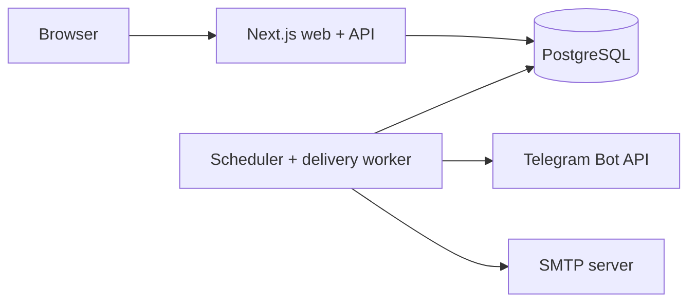

# Workspace

Workspace is a self-hosted personal productivity workspace for reminders, notes, and environment secrets. It brings together recurring obligations, markdown notes, and encrypted project environment secrets into a single, clean dashboard.

> **Project status:** Phase 4 notification delivery is implemented. The dashboard, durable PostgreSQL scheduler/queue, SMTP and Telegram adapters, retries, lease recovery, and asynchronous provider tests are runnable. Operations and release hardening remain in Phase 5.

## MVP at a glance

- See all active reminders as cards, ordered by the next occurrence.
- Create, edit, pause, resume, and delete a reminder without leaving the dashboard.
- Repeat once, daily, weekly, monthly, yearly, or at a custom interval.
- Enter and display dates in Gregorian or Solar Hijri (Jalali) form.
- Attach an optional amount in Iranian rial (`IRR`) or US dollar (`USD`).
- Send reliable email and Telegram notifications a chosen number of days early.
- Run the full stack with Docker Compose.
- Keep provider credentials and deployment-specific configuration outside source control.

The schedule date and recurrence rule are required in addition to the original requested reminder fields; without them, the system cannot calculate future occurrences.

## Product surface

1. **Login** — a single password, set as `AUTH_PASSWORD` in the environment. There are no accounts and no registration.
2. **Dashboard** — reminder cards, compact filters, empty/loading/error states, and an add button.
3. **Reminder modal** — title, description, type, date, recurrence, optional amount, lead time, notification channels, and active state.
4. **Settings modal** — calendar system, default currency, email enabled, and Telegram enabled. Provider configuration remains in the environment.

There are no projects, teams, reports, social features, or notification inbox in the MVP. It is designed first for one person running one trusted instance.

## Technology decisions

| Concern              | Choice                                                   | Reason                                                                   |
| -------------------- | -------------------------------------------------------- | ------------------------------------------------------------------------ |
| Web and API          | Next.js App Router, React, TypeScript                    | One type-safe full-stack codebase and a good self-hosting path           |
| Styling              | Design tokens + Radix primitives                         | Precise visual control with accessible modal and form behavior           |
| Forms and validation | React Hook Form + Zod                                    | Shared client/server validation and clear form errors                    |
| Database             | PostgreSQL                                               | Transactions, constraints, durable schedules, and queue-safe row locking |
| Data access          | Checked-in SQL migrations                                | Typed access without hiding database behavior                            |
| Worker               | Node.js process using a PostgreSQL-backed delivery table | Reliable retries and no Redis requirement for the MVP                    |
| Email                | SMTP via Nodemailer                                      | Provider-neutral self-hosting                                            |
| Telegram             | Telegram Bot API over `fetch`                            | Minimal dependency and straightforward deployment                        |
| Testing              | Vitest, React Testing Library, Playwright                | Unit, component, integration, and end-to-end coverage                    |
| Packaging            | pnpm workspaces; one multi-stage Docker image            | Shared packages; the same image runs web, migrations, or worker          |
| Orchestration        | Docker Compose                                           | One operator command for app, worker, migration job, and database        |

## Architecture



The Compose stack exposes only the web service. PostgreSQL stays on the internal network. The web and worker use the same application image with different start commands.

## Local development

Prerequisites: Node.js 24+, Corepack/pnpm, Docker with Compose v2, and Git.

```bash
corepack enable
pnpm install --frozen-lockfile
cp .env.example .env
# Replace every CHANGE_ME value.
# Optional: set NERKH_API_TOKEN from https://nerkh.io/ for dashboard currency conversion.
docker compose up -d db
pnpm db:migrate
pnpm dev
```

In a second terminal:

```bash
pnpm dev:worker
```

Useful checks:

```bash
pnpm format:check
pnpm lint
pnpm typecheck
pnpm test
pnpm build
docker compose up --build -d
```

## Compose deployment

```bash
cp .env.example .env
# Edit .env and replace every placeholder secret.
docker compose up --build -d
docker compose ps
curl --fail http://localhost:${APP_PORT:-3000}/api/health/live
curl --fail http://localhost:${APP_PORT:-3000}/api/health/ready
```

Open `http://localhost:${APP_PORT}` only after `db`, `web`, and `worker` report healthy and `migrate` has exited successfully. See [Deployment](docs/DEPLOYMENT.md) for the full operational contract.

## Demo mode (VPS deployment)

To deploy a live, interactive demonstration on your VPS with 1-click login, auto-seeded sample data, simulated notification providers, and data reset capability:

```bash
cp .env.demo.example .env
docker compose up --build -d
```

See [Demo Mode Deployment Guide](docs/DEMO_MODE.md) for domain setup, reverse proxy (Caddy / Nginx), and automatic reset cron configurations.

## Documentation

- [Product specification](docs/PRODUCT_SPEC.md) — scope, behavior, requirements, and acceptance criteria
- [Demo mode guide](docs/DEMO_MODE.md) — VPS deployment, sandbox safety, and reverse proxies
- [Architecture](docs/ARCHITECTURE.md) — components, scheduling, reliability, security, and repository structure
- [Data model](docs/DATA_MODEL.md) — entities, constraints, calendar behavior, and queue semantics
- [API contract](docs/API.md) — REST resources, validation, errors, and examples
- [Design system](docs/DESIGN_SYSTEM.md) — visual direction, tokens, components, responsiveness, and accessibility
- [Deployment](docs/DEPLOYMENT.md) — Docker Compose, environment, health checks, backups, upgrades, and recovery
- [Testing and quality](docs/TESTING.md) — test pyramid, critical cases, and release gates
- [Roadmap](docs/ROADMAP.md) — implementation phases and definition of done
- [Contributing](CONTRIBUTING.md), [Security](SECURITY.md), [Code of Conduct](CODE_OF_CONDUCT.md), and [Changelog](CHANGELOG.md)

## Important behavioral rules

- `AUTH_PASSWORD` is the only credential. Every page and every `/api/v1/*` route requires a valid session; only `/api/health/*` is public. Changing the password signs out every browser, because the session cookie is signed with a key derived from it.
- `APP_TIMEZONE` is authoritative for delivery time; timestamps are stored in UTC.
- A reminder keeps the calendar system and currency used when it was created. Changing a global setting changes defaults and presentation, not historical meaning.
- Email sends only when SMTP is configured, email is globally enabled, and the reminder has email enabled. Telegram follows the equivalent three-part rule.
- Delivery rows are unique by reminder, occurrence, channel, and lead time. Sending is at-least-once with best-effort duplicate suppression; a rare duplicate is possible after an ambiguous provider acceptance/crash.
- Amounts are stored as integer minor units. The app never performs exchange-rate conversion.

## Open-source principles

- MIT licensed.
- No telemetry by default.
- No secrets committed to Git.
- Database migrations are reviewed and reversible where practical.
- Security issues use private GitHub Security Advisories.
- Every release publishes upgrade and backup notes.

## Contributing

The best starting point is [CONTRIBUTING.md](CONTRIBUTING.md).

## License

[MIT](LICENSE) © 2026 Workspace contributors.
