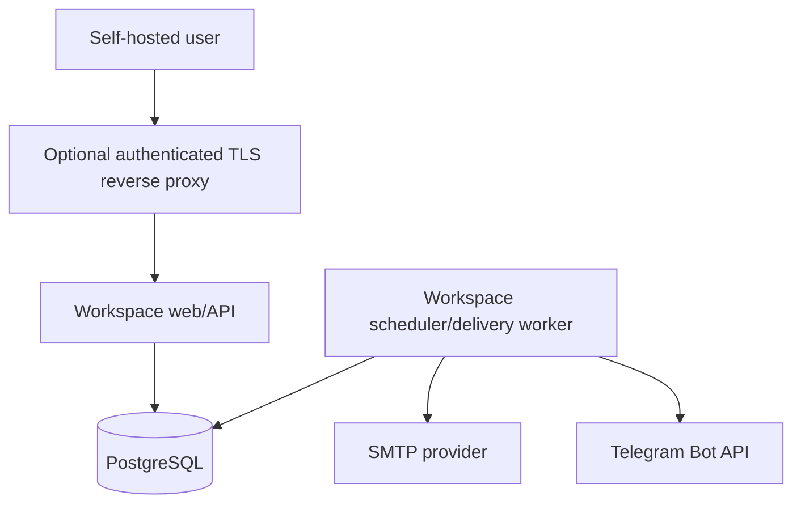
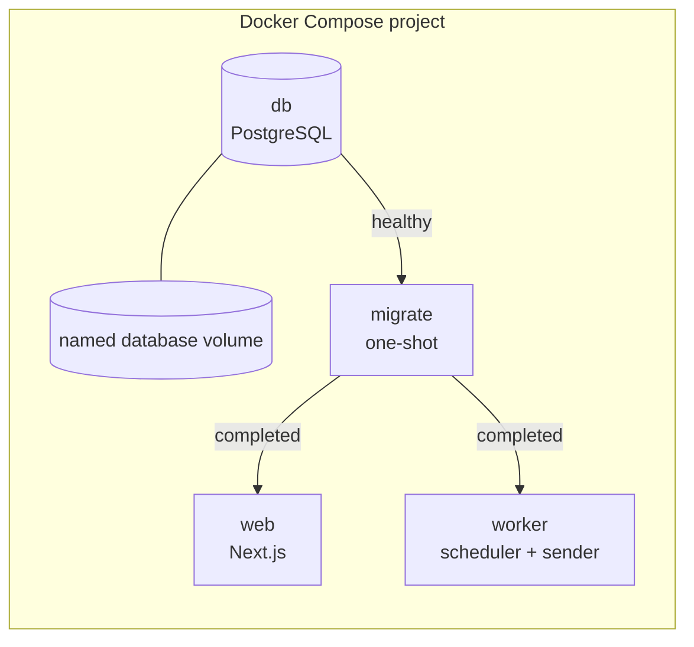

# Architecture

This document turns the product requirements into an implementation blueprint. It favors a small operational footprint and explicit database behavior over infrastructure breadth.

## 1. Architecture decisions

| Decision          | Choice                                                                        | Consequence                                                             |
| ----------------- | ----------------------------------------------------------------------------- | ----------------------------------------------------------------------- |
| Deployment unit   | One application image, run as web, worker, or migration command               | One build artifact to review and release                                |
| Orchestration     | Docker Compose with `db`, one-shot `migrate`, `web`, and `worker` services    | One operator command; no Kubernetes requirement                         |
| Primary datastore | PostgreSQL                                                                    | Durable state, constraints, transactions, locking, and portable backups |
| Queue             | `notification_deliveries` table in PostgreSQL                                 | No Redis/broker; queue behavior remains inspectable                     |
| Web stack         | Next.js App Router + TypeScript                                               | React UI and route-handler API share contracts                          |
| Data access       | Drizzle ORM + checked-in SQL migrations                                       | Type safety with visible SQL and reviewable migrations                  |
| Scheduling        | Polling worker with materialized occurrence date and UTC notification instant | Simple recovery after downtime; indexed queries                         |
| Delivery          | Lease/claim rows, send outside transaction, persist result                    | Short transactions and bounded concurrency                              |
| Auth boundary     | No built-in accounts in MVP                                                   | Deployment must remain private or sit behind authenticated TLS proxy    |
| Runtime telemetry | Structured logs and health endpoints; no remote analytics                     | Private by default and easy to operate                                  |

References: [Next.js self-hosting](https://nextjs.org/docs/app/guides/self-hosting), [Drizzle with PostgreSQL](https://orm.drizzle.team/docs/get-started-postgresql), [PostgreSQL locking clauses](https://www.postgresql.org/docs/current/sql-select.html), and [Docker Compose startup order](https://docs.docker.com/compose/how-tos/startup-order/).

## 2. System context



Only `web` publishes a host port. `db`, `migrate`, and `worker` are internal Compose services. Provider traffic is outbound HTTPS or SMTP from the worker.

## 3. Container topology



- `db`: pinned PostgreSQL image, internal-only, named volume, `pg_isready` health check.
- `migrate`: application image running checked-in migrations; must exit `0` before dependants start.
- `web`: application image running the Next.js Node server as a non-root user.
- `worker`: the same image running the scheduler/delivery entry point as a non-root user.
- Restart policy: `unless-stopped` for long-running services; no restart for a successfully completed migration job.

Compose must use long-form `depends_on` conditions so “container started” is not mistaken for “database ready.”

## 4. Target repository layout

```text
reminder/
├── apps/
│   ├── web/
│   │   ├── src/app/                 # App Router pages and API route handlers
│   │   ├── src/components/          # dashboard, cards, forms, settings
│   │   └── src/styles/              # tokens and global styles
│   └── worker/
│       └── src/                     # scheduler, queue claims, delivery loop
├── packages/
│   ├── config/                      # parsed/validated environment
│   ├── db/                          # schema, SQL migrations, repositories
│   ├── domain/                      # recurrence, money, shared schemas
│   ├── notifications/               # channel ports and provider adapters
│   └── ui/                          # original shared components/tokens
├── docs/
├── tests/
│   ├── fixtures/                    # trusted calendar/provider fixtures
│   └── e2e/
├── compose.yaml
├── Dockerfile
├── pnpm-workspace.yaml
└── package.json
```

pnpm workspaces are enough for the initial repository. Add a build orchestrator only when measured build times justify it.

## 5. Application layers

### UI layer

- Server-render the initial dashboard shell and reminder page data.
- Use client components only for modal state, filters, forms, and optimistic interaction.
- Keep server-only modules out of client dependency graphs through explicit package exports.
- Use Radix primitives for dialog, select, switch, tooltip, and alert dialog behavior, then apply the project’s own styles.

### HTTP/API layer

- Next.js route handlers expose `/api/v1` resources.
- Zod schemas validate route params, query strings, and JSON bodies.
- Route handlers call application services; they do not calculate recurrence or send provider messages directly.
- Mutation handlers use transactions and optimistic concurrency where defined.
- Errors use the stable envelope in [API.md](API.md).

### Domain layer

Pure modules own:

- recurrence validation and next-occurrence calculation;
- calendar conversion and last-valid-day policy;
- notification eligibility and notification date calculation;
- money parsing/formatting and minor-unit conversion;
- type presets;
- provider-neutral message content.

The domain package has no Next.js, React, Drizzle, network, or process-environment dependency.

### Persistence layer

- Drizzle schema definitions describe types and constraints.
- Reviewed SQL migrations are checked in and applied by the migration command.
- Repositories make transaction boundaries explicit.
- Raw SQL is acceptable for queue claims, advisory locks, partial indexes, and constraints where it is clearer than ORM composition.
- Production upgrades use `drizzle-kit migrate`; schema push/synchronization commands are development-only.

### Provider layer

```ts
interface NotificationProvider {
  readonly channel: "email" | "telegram";
  readiness(): ProviderReadiness;
  send(message: NotificationMessage): Promise<ProviderReceipt>;
}
```

- `SmtpNotificationProvider` uses pooled SMTP connections with bounded timeouts.
- `TelegramNotificationProvider` calls the HTTP Bot API with a timeout and escaped content.
- Provider adapters classify failures into retryable, rate-limited, configuration, authentication, recipient, and unknown categories.
- Provider SDK/request objects never cross the adapter boundary.

## 6. Calendar and time architecture

### Canonical concepts

```ts
type CalendarSystem = "gregorian" | "jalali";

type CalendarDate = {
  calendar: CalendarSystem;
  year: number;
  month: number;
  day: number;
};

type Recurrence = {
  frequency: "once" | "daily" | "weekly" | "monthly" | "yearly";
  interval: number;
  anchorDay: number;
  anchorMonth: number | null;
  anchorWasLastDay: boolean;
};
```

The database stores both:

1. **Semantic schedule** — local calendar components, recurrence calendar, interval, and anchor policy.
2. **Materialized schedule** — `next_occurrence_date` as a canonical Gregorian database `DATE` for date-only sorting/rollover, plus `next_notification_at` as a UTC instant for delivery scheduling.

This dual representation prevents global display changes from moving events, avoids pretending a date-only reminder has an event time, and keeps worker queries cheap.

### Adapter boundary

All calendar operations go through a `CalendarAdapter` interface: validate, days-in-month, convert to/from Gregorian, add days/months/years, compare, and format. Implementation may use `Intl.DateTimeFormat` for presentation and a small pinned Jalali conversion library for arithmetic, but fixture tests—not library reputation—define accepted behavior.

### Timezone rules

- `APP_TIMEZONE` must be a valid IANA identifier and is parsed at process startup.
- Local recurrence is calculated in that zone, then converted to UTC.
- The configured `NOTIFICATION_SEND_TIME` is a local wall-clock time.
- DST gaps use the first valid instant after the gap; overlaps use the earlier matching instant. The choice is deterministic and tested.
- Changing `APP_TIMEZONE` requires pausing the worker, running a schedule-recompute maintenance command, then restarting.

### Recurrence algorithm

1. Read the immutable anchor and current materialized occurrence date.
2. Advance in the reminder’s recurrence calendar by `interval` units.
3. If the target day is invalid, use the target month’s last valid day without changing the anchor.
4. Convert the valid local date to its canonical Gregorian `DATE`, and calculate the notification instant at configured local send time minus lead days.
5. Repeat until the result is strictly after the current materialized occurrence date and valid for the requested operation.

The current occurrence remains materialized through its entire local date. The worker advances/completes it on the first pass after that local date ends, after ensuring any catch-up delivery is represented.

The implementation must be iteration-bounded and reject corrupt rules rather than loop indefinitely.

## 7. Scheduling and delivery

### Scheduler pass

Every `NOTIFICATION_POLL_INTERVAL_SECONDS`:

1. Start a transaction and attempt a PostgreSQL transaction-level advisory lock for the scheduling pass.
2. Select a bounded batch of active reminders whose notification time is due or whose occurrence must advance.
3. For each eligible channel, insert one `notification_deliveries` row with `ON CONFLICT DO NOTHING` against the unique delivery key.
4. Mark non-eligible but previously pending rows cancelled when global/reminder state changed.
5. If the occurrence is reached, advance recurring reminders or complete one-time reminders.
6. Commit quickly; no provider network call occurs in this transaction.

The advisory lock reduces duplicate work. Unique database constraints are the correctness boundary.

### Worker claim

1. Start a short transaction.
2. Select due `pending`/`retry` rows ordered by `next_attempt_at`, with `FOR UPDATE SKIP LOCKED` and a batch limit.
3. Set `status = processing`, a random lease owner, and lease expiry; increment the attempt counter.
4. Commit.
5. Send provider requests concurrently up to a small configured limit.
6. In separate short transactions, persist `sent`, `retry`, `failed`, or `expired` results.

PostgreSQL explicitly documents `SKIP LOCKED` as suitable for avoiding contention among consumers of a queue-like table.

### Failure and retry policy

Default delay sequence is approximately 1 minute, 5 minutes, 30 minutes, 2 hours, and 8 hours, with ±20% jitter and provider `Retry-After` taking precedence. Retries stop at `NOTIFICATION_MAX_ATTEMPTS` or when the catch-up window expires.

### Delivery guarantee

The system provides durable **at-least-once attempts with best-effort duplicate suppression**. The unique delivery key prevents duplicate queue rows and concurrent normal sends. SMTP and Telegram do not provide a transaction shared with PostgreSQL, so a process can crash after a provider accepts a message but before the receipt is persisted; a later retry can rarely produce a duplicate. Documentation and logs must state this honestly.

### Lease recovery

Rows left in `processing` past their lease expiry become claimable as `retry`. The previous attempt remains in structured error metadata without storing full message content or credentials.

## 8. Transaction boundaries

| Operation              | Transaction contents                                                                                                  |
| ---------------------- | --------------------------------------------------------------------------------------------------------------------- |
| Create reminder        | Insert reminder, calculate materialized occurrence date/notification instant, insert currently eligible delivery rows |
| Edit schedule/channels | Concurrency check, update reminder, cancel stale pending rows, insert new eligible rows                               |
| Pause                  | Update reminder, cancel pending/retry rows                                                                            |
| Resume                 | Update reminder, recalculate future occurrence, insert still-eligible rows                                            |
| Delete                 | Delete reminder; foreign-key cascade delivery history                                                                 |
| Update settings        | Upsert singleton settings; cancel newly disabled channel rows                                                         |
| Claim deliveries       | Row lock, status/lease/attempt update only                                                                            |
| Finish attempt         | Receipt or categorized error update only                                                                              |

Provider sends are always outside database transactions.

## 9. Configuration architecture

The `config` package parses the environment once at process startup. Invalid required values fail fast with safe messages. Optional provider configuration yields a structured unavailable state instead of crashing the whole application.

Configuration groups:

- Application: base URL, port, timezone, log level.
- Scheduler: send time, poll interval, grace hours, maximum attempts.
- Database: PostgreSQL URL and pool limits.
- SMTP: host, port, transport security, username/password, from/to.
- Telegram: bot token and destination chat ID.
- Initial defaults: calendar, currency, and global channel booleans.

Environment values are never sent wholesale to the browser. Client configuration is an allowlisted projection containing only non-secret availability booleans.

## 10. Security boundaries

### Network access

The MVP has no account system. Safe deployment is one of:

- bind the published port to loopback and access through an SSH tunnel;
- use a private overlay/VPN network;
- place an authenticated HTTPS reverse proxy in front of the web container.

Do not publish the app unauthenticated to the public internet. The official Next.js self-hosting guide also recommends a reverse proxy in front of the Node server.

### Application controls

- Same-site mutation protection: strict origin validation and CSRF token where the proxy/browser topology needs it.
- `Content-Security-Policy` with self-only scripts/styles except documented hashes/nonces.
- `X-Content-Type-Options`, `Referrer-Policy`, frame denial, and conservative permissions policy.
- JSON body-size limits and rate limits at the proxy for mutation/test endpoints.
- Plain-text storage for user content; context-aware escaping at HTML, email, and Telegram outputs.
- Non-root runtime user, minimal production dependencies, read-only root filesystem where compatible.
- No secrets in image layers, build arguments, client bundles, logs, health payloads, or error responses.

### Dependency controls

- Lockfile committed and immutable installs in CI.
- Dependency updates reviewed in small batches.
- CI scans dependencies, images, licenses, and leaked secrets.
- Runtime image is pinned by digest for releases and rebuilt regularly for security patches.

## 11. Observability

### Structured logs

Use newline-delimited JSON in production with fields such as:

```json
{
  "level": "info",
  "event": "notification.sent",
  "deliveryId": "uuid",
  "reminderId": "uuid",
  "channel": "telegram",
  "attempt": 1,
  "durationMs": 184
}
```

Allowed identifiers are internal UUIDs and safe enums. Default logs omit title, description, amount, recipient, chat ID, email address, provider response body, and credentials.

Recommended events:

- `app.started`, `app.config_invalid`, `db.migration_completed`;
- `scheduler.pass_completed`, `scheduler.pass_skipped_lock`, `scheduler.occurrence_advanced`;
- `notification.claimed`, `notification.sent`, `notification.retry_scheduled`, `notification.failed`, `notification.expired`;
- `provider.test_requested`, `provider.test_succeeded`, `provider.test_failed`;
- `worker.heartbeat`, `worker.shutdown_started`, `worker.shutdown_completed`.

### Health surfaces

- `GET /api/health/live`: process loop responds; no dependency check.
- `GET /api/health/ready`: configuration parsed, migrations current, and database query succeeds.
- Worker container health command: heartbeat updated within twice the poll interval and database reachable.
- Provider readiness shown in Settings validates configuration shape only; routine health checks must not send messages or repeatedly connect to providers.

Health responses contain status/category only, never connection strings or provider details.

## 12. Scaling limits and evolution

The PostgreSQL queue comfortably serves the expected personal-instance workload. Before adding Redis or a broker, measure queue depth, claim latency, lock wait, and database load.

Potential evolution paths:

- multiple web replicas require shared Next.js cache coordination or deliberately dynamic/no-cache reminder routes;
- multiple workers already cooperate through row claims and leases;
- multi-user support requires authentication, tenant ownership on every row, authorization tests, recipient storage/encryption, and a migration plan;
- multiple notification offsets require changing the delivery uniqueness key and modal model;
- webhooks or new providers implement the existing provider interface.

## 13. Architecture quality gates

- Domain packages pass without a database or network.
- A clean migration creates all constraints and indexes; a second migration run is a no-op.
- Scheduling tests run with two worker processes and prove one queue row per unique key.
- Crash-recovery tests cover before send, during ambiguous provider response, and after receipt persistence.
- Client bundles contain no server environment values or provider packages.
- Container inspection confirms non-root runtime, expected ports, and no secret-bearing build layers.
- Backup from the previous release restores and migrates successfully into the release candidate.
